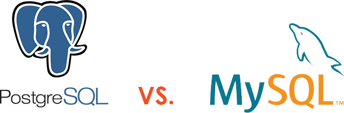

# 🛠️ Full-Stack Projects Repository

Welcome to my collection of full-stack projects and mini-projects, featuring Django applications containerized with Docker alongside modern web development technologies. This repository showcases both complete applications and smaller utilities built as part of my learning journey and contributions to real-world problems.


## 📁 Repository Structure

```
full-stack-projects/
│
├── django-projects/
│   ├── project-name-1/
│   │   ├── docker-compose.yml
│   │   ├── Dockerfile
│   │   ├── requirements.txt
│   │   ├── manage.py
│   │   └── app/
│   └── mini-project-1/
│
├── react-projects/
│   ├── next-app-1/
│   └── react-mini-project/
│
├── node-projects/
│   ├── express-api/
│   └── node-utilities/
│
├── java-projects/
│   └── spring-boot-app/
│
├── database-projects/
│   ├── mysql-schemas/
│   ├── postgresql-migrations/
│   └── supabase-integrations/
│
└── README.md
```

<br>

## 🧰 Tech Stack

### Backend Technologies
- **Python:** [Django](https://www.djangoproject.com/), Flask
- **Java:** Spring Boot, Core Java
- **Node.js:** Express.js, REST APIs
- **Containerization:** [Docker](https://www.docker.com/), Docker Compose

### Frontend Technologies
- **React:** [React.js](https://reactjs.org/)
- **Next.js:** [Next.js](https://nextjs.org/) for server-side rendering
- **Vanilla Web:** HTML5, CSS3, JavaScript (ES6+)
- **Styling:** Bootstrap, Tailwind CSS, Material-UI

### Databases
- **SQL Databases:** MySQL, PostgreSQL, SQLite
- **Cloud Database:** [Supabase](https://supabase.com/)
- **Database Tools:** pgAdmin, MySQL Workbench

### Dev Tools
- **Version Control:** Git, GitHub
- **Editors:** VS Code, IntelliJ IDEA
- **Deployment:** Docker, Vercel, Railway

<br>

## 🚀 Getting Started

### Prerequisites

Ensure you have the following installed:

- Docker: [Install Docker](https://docs.docker.com/get-docker/)
- Docker Compose
- Node.js: [Install Node.js](https://nodejs.org/)
- Python 3.8+: [Install Python](https://www.python.org/)
- Java 11+: [Install Java](https://adoptopenjdk.net/) (for Java projects)
- Git

<br>

### Clone the Repository

```bash
git clone https://github.com/<your-username>/full-stack-projects.git
cd full-stack-projects
```

<br>

### Running Projects

#### Django Projects (Docker)
```bash
cd django-projects/project-name-1
docker-compose up --build
```
Your Django app will be available at `http://localhost:8000`.

#### React/Next.js Projects
```bash
cd react-projects/next-app-1
npm install
npm run dev
```
Your React app will be available at `http://localhost:3000`.

#### Node.js Projects
```bash
cd node-projects/express-api
npm install
npm start
```
Your Node.js API will be available at `http://localhost:3001`.

#### Java Projects
```bash
cd java-projects/spring-boot-app
./mvnw spring-boot:run
```
Your Java app will be available at `http://localhost:8080`.



## 🧪 Example Projects

### 🔹 Full-Stack Blog Platform
**Tech Stack:** Django + React + PostgreSQL + Docker
* `/django-projects/blog-platform`
* Features: User authentication, post editor, comment system, admin dashboard
* Dockerized with PostgreSQL database

### 🔹 E-commerce API
**Tech Stack:** Node.js + Express + MySQL + React
* `/node-projects/ecommerce-api` + `/react-projects/ecommerce-frontend`
* Features: Product catalog, user management, order processing
* MySQL database with React frontend

### 🔹 Task Management App
**Tech Stack:** Next.js + Supabase
* `/react-projects/task-manager`
* Features: Real-time updates, user authentication, project collaboration
* Supabase backend with Next.js frontend

### 🔹 Java Spring Boot REST API
**Tech Stack:** Java + Spring Boot + PostgreSQL
* `/java-projects/inventory-system`
* Features: CRUD operations, JWT authentication, data validation
* PostgreSQL database integration

### 🔹 Database Learning Projects
* `/database-projects/mysql-schemas` - MySQL database design patterns
* `/database-projects/postgresql-migrations` - Advanced PostgreSQL features
* `/database-projects/supabase-integrations` - Real-time database applications

<br>

## 🗄️ Database Configurations

### MySQL
```yaml
# docker-compose.yml example
services:
  db:
    image: mysql:8.0
    environment:
      MYSQL_DATABASE: myapp_db
      MYSQL_USER: myapp_user
      MYSQL_PASSWORD: password123
```

### PostgreSQL
```yaml
# docker-compose.yml example
services:
  postgres:
    image: postgres:13
    environment:
      POSTGRES_DB: myapp_db
      POSTGRES_USER: postgres
      POSTGRES_PASSWORD: password123
```

### Supabase
```javascript
// supabase configuration
import { createClient } from '@supabase/supabase-js'

const supabaseUrl = 'your-project-url'
const supabaseKey = 'your-anon-key'
const supabase = createClient(supabaseUrl, supabaseKey)
```

<br>

## 🗃️ Additional Notes

* All environments are isolated via Docker containers
* Database credentials and environment settings can be found in `.env.example` files
* Default admin credentials (when applicable):
  * **Username:** `admin`
  * **Password:** `admin123`
* Each project includes its own README with specific setup instructions

<br>

## 🎯 Future Improvements

* **DevOps:** Add CI/CD pipeline with GitHub Actions
* **Cloud:** Deploy to AWS, Google Cloud, or Azure
* **Performance:** Add Redis caching and load balancing
* **Testing:** Implement comprehensive test suites
* **Security:** Add OAuth2, JWT authentication across all projects
* **Monitoring:** Integrate logging and monitoring solutions

<br>

## 📚 Learning Resources

This repository serves as a practical implementation of concepts from:
- Web development bootcamps and courses
- Database design principles
- Container orchestration best practices
- Modern JavaScript frameworks
- Backend API development
- Full-stack application architecture

<br>

## 📬 Contact

Feel free to connect with me on:

* 🌐 [LinkedIn](https://www.linkedin.com/in/marknature-c/)


## 📄 License

This repository is open-source and available under the [MIT License](LICENSE).